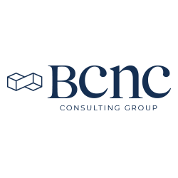

# 
# BCNC Reto: Servicio REST de Consulta de Precios

Servicio REST para consulta de precios (Arquitectura Hexagonal, DDD).

## Tecnologías
- Java 21, Spring Boot 3
- H2 (en memoria), JPA, Lombok
- MapStruct, Kafka
- JUnit 5, Mockito
- SonarQube

## Arquitectura
- **domain**: entidad `Price`, reglas de negocio.
- **repository**: interfaz JPA con query para prioridad.
- **service**: orquestación, manejo de excepciones.
- **controller**: API-FIRST, DTOs.
- **mapper**: MapStruct para conversión entity↔dto.
- **config**: KafkaProducer/Consumer.
- **exception**: manejo de excepciones personalizadas.
- **test**: pruebas unitarias y de integración.
- **util**: constantes y utilidades.
- **security**: configuración de seguridad (JWT).
- **swagger**: documentación Swagger/OpenAPI.
- **docker**: Dockerfile y docker-compose para despliegue.
- **kafka**: configuración de Kafka para mensajería asíncrona.
- **monitoring**: métricas y logs con Actuator y Micrometer.
- **caching**: implementación de caché con Redis.
- **validation**: validación de entradas con Hibernate Validator.
- **async**: manejo de operaciones asíncronas con @Async.
- **scheduling**: tareas programadas con @Scheduled.
